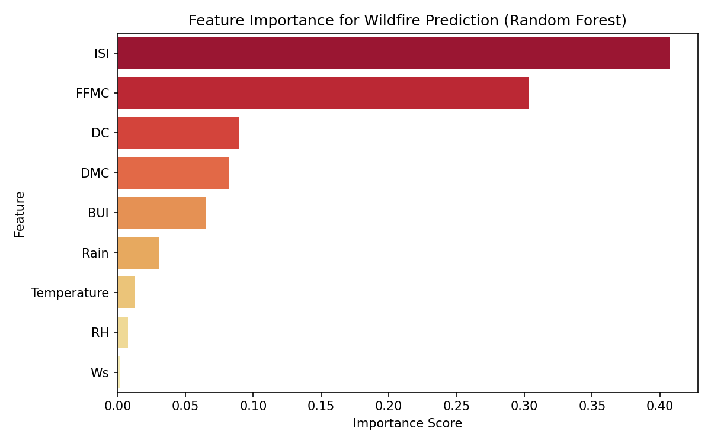
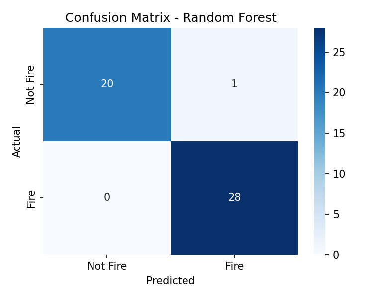

# 🔥 Algerian Forest Fire Prediction using Machine Learning

Predicting forest fire occurrence in Algeria using meteorological data and Fire Weather Index (FWI) components, with a Random Forest classifier achieving **98% accuracy**.


**[](https://colab.research.google.com/github/Machine-Learning-Based-Wildfire/Machine-Learning-pipeline-predicts-daily-wildfires-in-Algeria/blob/main/notebooks/Algerian_Wildfire_Prediction.ipynb)**

---

## 📌 Problem Statement

Algeria has experienced increasingly severe wildfire seasons in recent years (e.g., the 2021 and 2022 Kabylie fires), with significant loss of forest cover, property, and human life. Early, data-driven risk assessment can help authorities allocate firefighting resources before ignition occurs.

Most existing wildfire ML studies focus on Europe, North America, or Asia, where dense sensor networks and long historical records exist. Algeria — and the Mediterranean Maghreb region more broadly — remains comparatively understudied despite sharing similar climatic fire drivers. This project addresses that gap using one of the few publicly available Algerian wildfire datasets.

## 📊 Dataset

**Source**: [Algerian Forest Fires Dataset](https://archive.ics.uci.edu/dataset/547/algerian+forest+fires+dataset) — UCI Machine Learning Repository (Abid & Izeboudjen, 2019), donated by the Center for Development of Advanced Technologies (CDTA), Algeria.

- **244 daily records** from two regions: **Bejaia** (northeast) and **Sidi Bel-Abbes** (northwest)
- **Period**: June–September 2012 (peak fire season)
- **Target**: Binary classification — `fire` (138 records) vs. `not fire` (106 records)

| Feature | Description | Range |
|---|---|---|
| Temperature | Noon temperature (°C) | 22–42 |
| RH | Relative Humidity (%) | 21–90 |
| Ws | Wind speed (km/h) | 6–29 |
| Rain | Total daily rainfall (mm) | 0–16.8 |
| FFMC | Fine Fuel Moisture Code | 28.6–92.5 |
| DMC | Duff Moisture Code | 1.1–65.9 |
| DC | Drought Code | 7–220.4 |
| ISI | Initial Spread Index | 0–18.5 |
| BUI | Buildup Index | 1.1–68 |
| FWI | Fire Weather Index | 0–31.1 |

> ⚠️ **Data quality note**: The raw CSV contains a formatting inconsistency at row 171 (a missing comma delimiter between the DC and ISI fields for one Sidi Bel-Abbes entry). This was identified and corrected during preprocessing — see `src/01_load_and_explore.py`.

## 🧠 Methodology

1. **Data cleaning**: Parsed the dual-region CSV structure (two stacked tables with separate headers), unified into a single DataFrame with a `Region` indicator column.
2. **Feature engineering**: Used the 9 raw meteorological/FWI features as model inputs; excluded `FWI` itself and `Classes`-derived leakage.
3. **Modeling**: Trained and compared two classifiers:
   - **Random Forest** (200 trees, max depth 6)
   - **Logistic Regression** (baseline, with standardized features)
4. **Validation**: 80/20 stratified train-test split + 5-fold cross-validation to confirm the result is not an artifact of a lucky split.

## 📈 Results

| Model | Accuracy | Precision | Recall | F1-Score | ROC-AUC |
|---|---|---|---|---|---|
| **Random Forest** | **0.980** | 0.966 | 1.000 | 0.982 | 1.000 |
| Logistic Regression | 0.939 | 0.931 | 0.964 | 0.947 | 0.988 |

**5-fold Cross-Validation Accuracy**: 98.4% (± 2.4%)

<p align="center">
  
  
</p>

**Key finding**: `ISI` (Initial Spread Index) and `FFMC` (Fine Fuel Moisture Code) dominate feature importance (71% combined), consistent with fire science — both indices directly encode fuel flammability and expected fire spread rate.

### ⚠️ Limitations (important for scientific honesty)

- **Dataset size** (244 records) is small; results should be validated on larger, more recent data before operational deployment.
- **ISI and FFMC are themselves computed from temperature/humidity/wind** via the Canadian FWI system formulas, which partly explains the very high separability (AUC = 1.000) — there is inherent structure in the target definition, not just "free" predictive power.
- Data covers a single fire season (2012) in two regions; generalization to other Algerian wilayas or other years is untested.

## 🔌 NEW: Runs on a Real Microcontroller (TinyML)

We compressed the model to **5.2 KB of source / ~1.4 KB compiled** and auto-generated dependency-free C code that runs directly on an ESP32/Arduino — no internet, no server. Verified to match the original scikit-learn model **exactly** on all 49 test rows (0 mismatches). See [`embedded/README.md`](embedded/README.md) and the companion systems paper [`paper/embedded_wildfire_paper.docx`](paper/embedded_wildfire_paper.docx). Try it with zero hardware at [wokwi.com](https://wokwi.com).

## 🌐 Try the Interactive Web App

**[🔥 Live Demo](https://your-app-name.streamlit.app)** *(update this link after deploying — see below)*

Move the sliders for temperature, humidity, wind, rain, and FWI indices and get an instant fire-risk prediction — no coding or setup required.

> 💡 After deploying (see Option C below), take a screenshot of the app and add it here — it makes the README much more compelling for reviewers.

## 🚀 How to Run

### Option A — One click, no setup (recommended for reviewers)
Click the **Open in Colab** badge above. The notebook downloads the dataset automatically and runs end-to-end in the browser.

### Option B — Locally
```bash
git clone https://github.com/Machine-Learning-Based-Wildfire/Machine-Learning-pipeline-predicts-daily-wildfires-in-Algeria.git
cd Machine-Learning-pipeline-predicts-daily-wildfires-in-Algeria
pip install -r requirements.txt

cd src
python 01_load_and_explore.py   # cleans raw data -> data/cleaned_data.csv
python 02_train_model.py        # trains models, saves plots to outputs/
python 03_save_model.py         # saves trained model to models/rf_model.joblib

cd ..
streamlit run app.py            # launches the web app at localhost:8501
```

### Option C — Deploy your own free live demo (5 minutes)
1. Go to [share.streamlit.io](https://share.streamlit.io) and sign in with GitHub
2. Click **"New app"** → select this repository → main file path: `app.py`
3. Click **Deploy** — Streamlit installs `requirements.txt` automatically and gives you a public URL
4. Update the **Live Demo** link above with your new URL

## 📁 Project Structure

```
wildfire-project/
├── data/
│   ├── Algerian_forest_fires_dataset_UPDATE.csv   # raw data
│   └── cleaned_data.csv                            # processed data
├── notebooks/
│   └── Algerian_Wildfire_Prediction.ipynb          # self-contained Colab notebook
├── src/
│   ├── 01_load_and_explore.py
│   ├── 02_train_model.py
│   ├── 03_save_model.py                            # saves model for the web app
│   └── 04_generate_embedded_model.py               # compresses model + generates C code
├── models/
│   ├── rf_model.joblib                              # full model (98% accuracy)
│   └── rf_model_embedded.joblib                     # compressed model (95.9% accuracy)
├── embedded/                                         # 🔌 TinyML microcontroller module
│   ├── wildfire_model.h                              # auto-generated C model
│   ├── test_equivalence.c                            # Python<->C correctness validation
│   ├── main.ino                                      # Arduino/ESP32 demo sketch
│   ├── wokwi/                                        # browser simulation config
│   └── README.md
├── outputs/
│   ├── feature_importance.png
│   ├── confusion_matrix.png
│   └── roc_curve.png
├── paper/
│   ├── wildfire_paper.docx                           # main ML paper
│   └── embedded_wildfire_paper.docx                  # TinyML systems paper
├── app.py                                            # Streamlit interactive web app
├── requirements.txt
└── README.md
```

## 🔭 Future Work

- Extend to **multi-year, multi-region** data across Algeria and the wider Mediterranean Maghreb.
- Incorporate **satellite imagery** (Sentinel-2/MODIS) for a multi-modal spatial-temporal model.
- Explore **domain adaptation** between Algerian and European wildfire datasets to address regional data scarcity — a direction outlined as future work in the accompanying paper.

## 📄 Citation

If you use this dataset, please cite the original source:
> Abid, F., Izeboudjen, N. (2019). *Predicting Forest Fire in Algeria Using Data Mining Techniques: Case Study of the Decision Tree Algorithm*. UCI Machine Learning Repository. https://doi.org/10.24432/C5KW4N

## 📝 License

This project is licensed under the MIT License.
